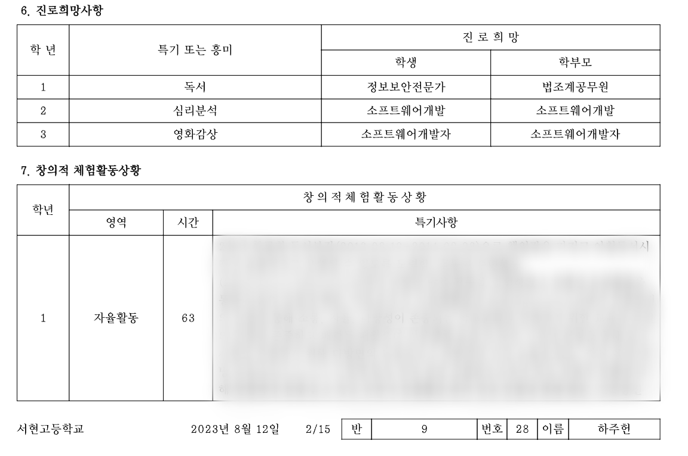

## 아주 단순한 계기

어린 시절에 나는 컴퓨터를 아주 좋아하는 아이였다. 당연히 주 컨텐츠는 게임이었다. 메이플스토리, 카트라이더, 그랜드체이스를 열심히 했던 기억이 난다. 하지만 그 무렵 대부분의 내 또래가 그렇듯 하루에 사용할 수 있는 컴퓨터 시간은 정해져 있었다. 그래서 나는 어떻게 하면 컴퓨터를 원하는만큼 할 수 있을까 고민에 빠지다가 문득 한가지 생각이 뇌리를 스쳤다.

> 프로그래머가 된다면 하루종일 컴퓨터를 할 수 있지 않을까?

이 단순무식한 발상이 내가 개발자가 되기로 마음을 먹은 최초의 계기다.  
이때 내 나이는 중2(15살), 2011년이었다.

그날부로 프로그래머라는 직업에 대해서 조사하기 시작했다.  
당시에는 프로그래머(개발자)라는 직업에 대한 인식이 지금처럼 좋지만은 않았다. 대부분 야근은 많이하면서 박봉을 받는 일명 3D 직군에 속했기 때문이다. 하지만 중2 시절의 나에게는 겨우 그런 이유들 따위로 꿈을 꺾을 수는 없었다. 오히려 너무 어린 나이였기 때문에 아직 현실의 높은 벽을 마주해보지 못했기
때문일 수도 있다.

다음으로 개발자가 되기 위해서는 어떻게 해야하는지 찾아 보았다.  
_'프로그래머는 기본적으로 프로그래밍 언어를 사용하면서 컴퓨터와 상호작용을 하는 직업이다. 그 중에서도 가장 기본은 C언어이다.'_  
라는 맥락의 글을 읽었다. 곧바로 나의 다음 목표는 'C언어 마스터'로 정해졌다.

## 프로그래밍과의 첫 만남

요즘이야 서점이든 온라인 강의든 C언어를 비롯한 각종 프로그래밍 언어를 학습할 수 있는 방법이 널리고 널렸지만, 그 당시에 프로그래밍 입문자가 독학으로 공부할 수 있는 방법은 거의 전무했다. 그렇지만 나 같은 입문자를 구원해준, 가뭄에 콩 나듯 출시된 입문서가 한 권 있었으니 그 책이 '윤성우의 열혈 C프로그래밍'이었다(이 글을 쓰며 교보문고에서 검색을 해보았는데 놀랍게도 아직까지 절판되지 않고 판매량에서도 상위권에 위치하고 있었다).

_내가 처음으로 구입한 열혈 C프로그래밍. 아직도 고이 보관 중이다._

나는 조금의 고민도 없이 바로 책을 사서 공부하기 시작했다. 그 당시에 C언어 처음 공부하는 사람들은 공감하겠지만 비주얼 스튜디오로 초기 환경 세팅하기까지 거쳐야하는 난관이 상당했다.  
우선 비주얼 스튜디오를 설치해야 했는데, 설치 파일이 상당히 무거울뿐더러 게임이나 일반인을 대상으로 하는 상업용 소프트웨어와 달리 개발자를 대상으로 하는 프로그램이다보니 설치 과정이 썩 친절하기 못한 걸로 기억한다.  
아무튼 여러 우여곡절을 겪으며 설치를 완료하고 나면 새 프로젝트(단축키 Ctrl + Shift + N) -> 새 소스코드(Ctrl + Shift + A) -> 파일이름 `hello.c`으로 생성 과정까지 마치게 된다.

이제 드디어 코드를 작성할 수 있게 된다. 아주 유명한 코드인 `printf('Hello World!');` 를 작성하고나서 '실행'버튼을 누르면서 두근두근했던 심정, 콘솔창이 뜨면서 `Hello World!`가 적혀있는 걸 확인했을 때의 그 짜릿한 순간의 기억은 아직까지도 생생하다. 그 때 나는 이 일을 직업으로 삼아야 되겠다고 확신하게 되었다.

나는 그렇게 책의 내용을 하나씩 습득해나갔다. 아무도 내게 시킨 적도 없고 알려주지도 않지만 정말 재미있었다. 내가 작성하는 코드에 따라서 컴퓨터가 이를 해석하고 결과가 나오는 일이 신기하다고 느껴졌다. 나는 이 매력에 빠져서 주말마다 게임 대신에 C언어 공부를 했다.  
비록 포인터를 공부할 때 살짝 위기가 찾아오기는 했지만 이해가 안 될때는 두번 세번이고 반복하면서 익숙해질 때까지 연습했다. 나에게 프로그래밍 공부는 억지로 해야하는 '숙제'가 아니었다. 내 인생에서 처음으로 찾은 '내가 하고 싶은 공부'였기 때문이다.

이 책은 여전히 나의 책장 한 켠에 꽂혀있다. 비록 본인이 웹 개발자라는 이유로 인해 각종 자바스크립트 서적에 둘러싸여 있어서 펼쳐볼 일이 거의 없지만, 나의 개발자 커리어의 첫 스타트를 끊어주었다는 기념비적인 책이기 때문에 앞으로 내가 개발자로서 어떤 커리어를 선택하더라도 이 책을 위한 공간은 항상 남겨두려고 한다.

## 장래희망 : 프로그래머

초중고에서는 매년 학기 초에 장래희망 조사를 했었다. 보통 초등학교까지는 정말 순수한 마음으로 자기가 좋아하는 일, 커서 하고싶은 일을 적기 마련이지만, 중고등학교부터는 현실과 마주하게 되고 장래희망도 입시를 위해 자신의 꿈을 양보하는 대신에 그 자리는 안정적이거나 사회적 지위가 높은 직업으로 획일화 되기 마련이다.

그럼에도 나는 중3부터 고3에 이르기까지 장래희망 조사칸을 모두 '프로그래머'라고 적었다. 내 주변에 장래희망을 프로그래머라고 적은 친구들은 매우 드물었다. 지금처럼 중고등학교에서 코딩이 교육과정으로 포함되어 있지 않았기 때문에 그만큼 프로그래밍에 대한 학생들의 인식이 높진 않았다. 무엇보다 부모님조차도 프로그래머라는 직업을 썩 탐탁치 않게 여기셨다. 위에서 언급했다시피 3D 직종이고 생소한 분야이다보니 나에게 다른 직업도 권유하셨지만 나는 확고했다.

그 나이의 대부분의 남자아이들이 그렇듯, 나 역시도 하나에 꽂히면 끝을 보는 성격이다. 나는 아래와 같은 근거를 준비해서 열심히 부모님을 설득했다.

> 내가 지금 C언어를 공부하고 있고...나는 이 공부가 재밌고...몇 년 뒤에는 프로그래머가 유망한 직종이 될 거고...그래서 남들보다 앞서갈 수 있고....

나의 간절함이 통했는지 부모님은 일단 잠정적으로는 허락해주셨다. 그리고 내가 부모님에게 요구한 조건 한 가지, 바로 **'앞으로 컴퓨터 사용시간에 간섭하지 않기'** 이다. 부모님께는 프로그래밍을 공부해야한다는 핑계로 대충 얼버무리면서 말했는데 이 요구를 수용해주셨다. 이제 나는 프로그래머가 되기 위한 모든 만반의 준비를 갖추게 되었다.

_(솔직히 그 시간동안 공부만 하지는 않았다. 부모님께는 공부한다 말하고 실제로는 몰래몰래 게임을 했다....)_

_당시 고등학교 생활기록부. 고1까지는 아직 부모님을 100% 설득시키지는 못하였다..._

고등학교에 와서는 정말 입시공부로 인해 프로그래밍 공부를 할 여유가 없어졌다. 다행히 교내 방과후 프로그램의 일종으로 프로그래밍 교실이 있어 신청해서 들을 수 있었다. 이미 내가 공부했던 C언어 기초 내용을 복습하는 수준이었지만 갈증을 해결해 줄 수는 있었다. 이 시절에는 하루빨리 입시공부 때려치우고 대학교에 가서 컴퓨터 공부나 하고 싶다는 생각밖에 없었다.

하지만 고3 현역 때 수능을 망치는 바람에 모의고사보다 훨씬 못한 성적표를 받아야했다. 여기서도 갈등이었다. 나는 가고자하는 전공이 확고하다보니 대학교의 네임밸류를 포기하더라도, 학과 공부와 개발 공부 열심히 하면 충분히 개발자로서 경쟁력이 있을 수 있다 생각했다.  
다른 한편으로는 불안감도 지울 수 없었다. 대학은 평생을 따라다닐 이름표인데 1년 정도는 시간을 더 투자할만 하지 않을까? 여기서 멈춰버리면 너무 아깝지 않을까?

결국에 재수를 선택하게 되었고 나는 1년을 더 공부했다. 다행히 재수생때는 수능을 그럭저럭 보고 나름 괜찮은 성적을 받았다. 나는 묻지도 따지지도 않고 컴퓨터공학(소프트웨어)학과에만 정시 원서를 넣었다. 사실 학과를 바꾸면 더 높은 학교로 진학할 수 있는 선택지도 있었지만 나에게는 오직 단 하나의 목표, 컴퓨터를 전공하고 싶은 마음 뿐이었다.

## 소프트웨어 전공생

그리고 나는 마침내 소프트웨어 전공생이 되었다. 이제 지긋지긋한 '공부를 위한 공부'는 때려치우고 '나를 위한 공부'를 할 수 있게 되었다.

사실 컴공(소웨)으로 대학에 들어오더라도 1학년부터 대단한 프로그래밍을 하진 않는다. 1,2학년은 C프로그래밍, 자료구조, 네트워크, 컴퓨터구조, 운영체제 등을 배우며 기본적인 CS지식의 기반을 다지는 단계이다. 그래서 저학년에는 코드를 작성하는 시간보다는 강의자료를 보면서 필기하는 데 더 많은 시간을 투자했다.

그래서 나는 코딩을 하고 싶었다. 갓 입학한 컴공과 학생이 해볼만한 코딩 중 한가지는 바로 프로그래밍 문제를 푸는 일이다. 그래서 나는 학과의 알고리즘 소학회에 가입하게 된다. 여기서부터 본격적으로 나의 6년동안의 문제풀이(소위 'PS'라고 부른다) 인생이 시작되었다. 그 소학회의 C언어 스터디의 커리큘럼이 조금 빡센 편이었는데, 나는 중고등학교 시절의 예습을 한 덕분인지 그럭저럭 따라갈 수 있었다.

이후 2,3학년이 되어서도 남들보다 쪼금 더 알고리즘 공부에 시간을 투자했다. 그 덕분에 전국 대학생 프로그래밍 경시대회인 ACM-ICPC 에 출전해보고, 소학회의 회장직을 맡아서 100명 이상의 사람들이 모인 커뮤니티 운영하며 C언어 기초 스터디의 강의(무려 3년이나)도 맡아보고, 그리고 교내 프로그래밍 경시대회의 문제 출제도 해볼 수 있었다.

이 시간은 대학 생활에서 값진 경험을 가져다 주었다. 그 경험의 교훈은 단순히 문제를 어떻게 푸는 지에 대한 방법보다 훨씬 더 귀중한 것이었다.
내가 생각해낸 풀이를 남들이 쉽게 이해할 수 있도록 설명하는 방법, 다른 사람이 생각해낸 풀이에 귀 기울이는 방법, 많은 사람들이 모인 커뮤니티를 운영하는 방법, C언어 스터디를 진행하며 포인터를 쉽게 설명하는 방법, 내 의견을 포기하고 남의 의견을 받아들이는 방법을 배웠다. 또한 축적된 경험이 알게 모르게 개발 공부를 하면서도 탄탄한 밑거름이 되어주었다.

_(알고리즘 문제 풀이가 개발실력에 도움을 줄 수 있느냐는 사람들마다 의견이 갈리는 주제이지만 나의 의견, 그리고 같이 알고리즘을 공부한 선배들의 의견들은 모두 만장일치로 '도움이 된다'는 의견이다. 다익스트라 알고리즘이나 DP가 실무의 문제를 직접적으로 해결해주지는 않지만 '데이터를 효율적으로 처리하는 방식'에 대한 직관력을 키울 수 있다.)_

내 대학 생활의 또 다른 특이점 중 하나는 (필수)전공과목 말고도 다른 학과의 강의를 많이 들었다. 개인적으로 흥미가 있었던 정수론, 사회심리학, 진화론과 같은 강의들을 들었다. _'대학교 때 아니면 언제 이런 강의 들어보겠어? 재밌을 것 같은데 한번 들어보자'_ 라는 생각을 갖고 있었다. 내가 궁금한 건 단순히 그 과목에서 가르치는 지식보다, 그 분야를 수십년동안 연구했던 교수님들이 세상을 바라보는 시선을 알고 싶었기 때문이었다. 대학교에서 마저도 중고등학교처럼 점수따기에 목숨 걸 필요는 없다고 생각했다.

나는 그렇게 3학년까지 학교를 다니다가 군 입대를 하게 된다. 보통 1학년 마치고 다녀오는 게 일반적인데 나는 타이밍을 놓쳐서 시간이 흐르다가 결국 그제서야 가게 되었다. 그나마 다행인 건 특기병으로 지원했기 때문에 야전으로 가지는 않았지만, 교대근무를 하며 하루종일 컴퓨터를 보는 일을 맡아 군생활의 1/4를 밤 새는 일로 보냈다 (평생 할 밤샘을 군대에서 다 했다).

군 복무 중에도 그냥 흘러만 가는 시간이 아까웠다. 그래서 부대 내 컴퓨터를 사용할 수 있는 사이버 지식 정보방(일명 '사지방')에서 나는 알고리즘 문제를 풀었다. 주로 코드포스에서 문제를 풀었는데 군 복무 기간동안 대략 400문제 정도 풀었다. 사지방 컴퓨터에는 로컬 IDE 설치가 불가능 했기 때문에 온라인 IDE를 찾아 헤매면서 코딩했던 기억이 난다. 게다가 정말 기막힌 우연 중 하나는, 같은 생활관의 후임 중 한명이 PS를 하는 친구였다. 나만큼 혹은 나보다도 더 문제 풀이에 진심인 친구였기 때문에 외롭지 않게 코딩할 수 있었다.

## FE 개발자의 길

군대를 전역하고 복학하니 4학년이 되어있었다. 이제 나도 본격적으로 취업 전선에 뛰어들 준비를 해야한다. 보통 개발자로 취준을 한다면 먼저 진로를 선택하기 마련이다. 마치 RPG 게임에서 초보자가 직업을 선택할 때 전사/마법사/궁수/도적으로 전직하는 것처럼 개발자도 마찬가지이다. 일반적으로 프론트엔드/백엔드/모바일/ML 중에서 본인의 진로를 정하게 된다.

내 주변의 컴공 전공생들은 80% 이상이 백엔드로 진로를 선택하는 경우가 많았다. 백엔드 분야가 전공자로서의 이점을 가장 잘 살릴 수 있으면서 대부분의 분야에서 널리 필요한 분야였기 때문이다. 모바일은 처음 공부를 시작하는 허들이 조금 있는 편이고, ML은 대학원이 90% 필수였다. 그리고 프론트엔드는 상당히 애매한 포지션에 위치한다. 4개 분야 중에서 그나마 CS 지식을 덜 필요로한다는 인식이 있기 때문에 비전공자나 디자인 파트에서 전향하는 사례가 꽤 있는 편이다.나도 그 당시에 프론트엔드와 백엔드를 두고 고민을 많이 했다. 전공자의 이점을 살릴 수 있는 백엔드를 선택할 수도 있었다.

하지만 프론트엔드는 개발하는 과정이 너무 재미있었다. 마치 중2때 처음 C를 접하고 코딩했었던 기억과 흡사했다. 내가 만든 결과물(웹페이지)이 다른 사람들에게 어떻게 보여질지 상상해면서 코딩을 하는 과정이 행복했고, 그 힘이 마치 무한동력처럼 작용해서 밤을 새서 코딩을 해도 힘들지가 않았다. 비록 프론트엔드 개발자의 진로가 상대적으로 치열하더라도, 내가 하고 싶은 일을 선택하는게 나중에 후회할 일을 만들지 않을 것이라고 생각했다.

이제 막 FE개발자 경력 1년을 채운 시점에서 돌이켜보자면 1년 전보다 상황이 더 치열해진 건 사실이다. 솔직히 '만약 내가 백엔드 개발자였다면?'을 몇 번 생각해 본 적도 있다.  
그래도 후회는 하지 않는다. 인생을 살아가는 나만의 신조 중 하나는 _'내가 내린 선택에 대해서는 절대 의심하지 말자'_ 이다. 1년 전으로 다시 돌아가도 나는 (조금 고민은 하겠지만)프론트엔드 개발자를 선택할 것이다.

내가 선택한 길이니 모든 책임은 나의 몫이다. 내가 더 열심히하면 극복할 수 있다고 생각한다.

## 지금

우리 사회에서 개인의 직업이 정해지는 과정이 그렇게 필연적이기는 어렵다. 자신이 좋아하는 일을 직업으로 삼기는 현실적으로 어렵기 때문이다. 따라서 일반적으로 입시 점수에 맞춰서 들어간 대학과 학과를 따라가기 마련이다.

하지만 나에겐 '개발자'라는 직업의 의미는 결코 가볍지 않다. 27살이 된 지금, 프로그래머가 되고자 처음으로 마음을 먹었던 15살을 기점으로 12년동안 간직해온 꿈이고 그 꿈을 직업으로 삼을 수 있다는 점에서 나는 프로그래밍을 하고 있는 순간이 너무나 소중한 기회라 여기고 있다. 내가 살아온 인생의 여정에서 개발자라는 직업은 너무나도 강하게 결합되어 있다.

내가 남들보다 더 훌륭하다거나 돈을 더 많이 버는 개발자는 아닐 수도 있지만 한 가지는 확신할 수 있다.

**이 일을 내가 하고 싶은 일이다.**
