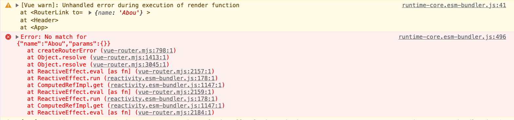

_2023-05-05에 작성된 [원문](https://ps-hjhj97.tistory.com/229)을 수정한 버전입니다_

## vue-router를 사용하는 두 가지 방법

vue에서는 `vue-router`에서 제공하는 `<router-link>` 컴포넌트로 페이지 이동을 하려면 크게 두 가지 방법이 있는데, 하나는 해당 페이지의 `pathname`을 직접 적는 방법과 다른 하나는 `router`에서 미리 정의해둔 `route name`을 적는 방법이다.

```jsx
// 방법 1
<router-link to="/">홈</router-link>
<router-link to="/about">어바웃</router-link>
```

```jsx
// 방법 2
<router-link :to="{name : 'Home'}">홈</router-link>
<router-link :to="{name : 'About'}">어바웃</router-link>

// 그리고 vue-router에서 미리 route별로 name을 지정해주어야 한다
const routes = [
	{
		path: '/',
		name: 'Home',
		component: ...,
	},
	{
		path: '/about',
		name: 'About',
		component: ...,
	},
]
```

## 하지만 오타가 난다면?

나는 개발할 때 주로 방법 2를 선호하는데 그 이유는 방법 1의 경우에는 경로명을 잘못 입력하더라도 에러로 검출해내지 못하고 클릭하면 `/abou`페이지로 이동시켜버리는 반면에, 방법 2는 아래와 같이 개발자 도구의 콘솔창에서 에러를 띄워주기 때문이다.

```jsx
// 방법 1
<router-link to="/">홈</router-link>
<router-link to="/abou">어바웃</router-link> // 오타, 에러 발생X
```

```jsx
// 방법 2
<router-link :to="{name : 'Home'}">홈</router-link>
<router-link :to="{name : 'Abou'}">어바웃</router-link> // 오타, 에러 발생함
```



방법 1은 오타가 발생하더라도 해당 라우터를 클릭해서 404 페이지가 뜨는 걸 확인하기 전까지는 찾기가 어렵다. 왜냐하면 사용자가 오타를 낸 건지, 아니면 정말로 `/abou`페이지로 이동하길 원하는지 라우터에게는 알 수 있는 정보가 없기 때문이다.

반면에 방법 2에서는 라우터를 클릭하기 전에도 콘솔창에서 에러를 검출할 수 있다. `routes`에 들어있는 원소를 하나씩 뒤져보면서 name이 `Abou`와 일치하는 라우트를 찾아본다. 일치하는 라우트가 없으면 에러로 판별해낼 수 있는 단서가 제공된다는 뜻이다.

이런 식으로 vue 에서는 `named-route`기반으로 페이지 이동이 가능하기 때문에 예상치 못한 오타 발생시 에러로 검출할 수 있는 반면에 react에서 `<Link to={'/about'}` 또는 `useNavigate`훅의 `navigate('/about')`와 같이 `pathname` 기반으로만 이동할 수 있다.

따라서 위의 언급한 방법 1처럼 오타로 인한 route 이동을 막을 수 있는 방법은 아직까지는 찾지 못하였다. 타입스크립트로 `pathname`을 `enum`이나 `type`으로 변수화시키는 방법이라면 가능할 지도 모르겠다는 생각은 드는데, 실무에서도 그렇게 개발할 지는 모르겠다.

---

## 현재 페이지 판별

위 주제와 비슷한 궁금증.

리액트에서는 현재 접속해있는 페이지를 판별하는 방법에 대해서이다.
예를 들어 현재 접속한 페이지와 일치하면 class에 `isMatched`를 붙여서 하이라이트 스타일을 주는 상황을 생각해보자.
vue로 구현한다면 아래와 같다.

```jsx
  <router-link :to={name : "Home"} class="{ matched : $route.name === 'Home'}">
    Home
  </router-link>
  <router-link :to={name : "About"} class="{ matched : $route.name === 'About'}">
    About
  </router-link>
```

사실상 스크립트 코드를 하나도 작성하지 않고 template 레벨에서만 현재 라우트 일치 여부를 판별해낼 수 있다.

이걸 react 로 작성해본다면

```jsx
function Header() {
  const { pathname: currentPath } = useLocation()
  const isMatch = (path: string) => {
    if (currentPath === path) return "matched"
  }
  return (
    <Nav>
      <Link to="/" className={currentPath === "/" ? "matched" : ""}>
        Home
      </Link>
      <Link to="/about" className={isMatch("/about")}>
        About
      </Link>
    </Nav>
  )
}
```

우선 `useLocation`훅을 통해서 현재의 `pathname`을 한번 뽑아와야하며, `<Link>`에서도 클래스를 동적으로 바인딩 할 때도 삼항연산자로 판별하거나, 코드를 줄이려면 `isMatch`함수를 하나 선언해서 인자로 현재 `<Link>`의 `To` 값을 그대로 넣어줘야 한다(물론 이건 vue도 마찬가지다).

vue는 template 레벨에서 `$route.name` 으로 현재 라우트 정보를 한방에 가져올 수 있고, class-binding을 할 때에도 `:class={isMatched : someValue}` 에서 `someValue`값이 true면 곧바로 클래스 이름으로 붙일 수 있어 편리하다.

vue는 `너한테-이런게-필요할거-같았어` 기능(함수)들이 미리 제공되어있는 반면에 react는 `너가-직접-구현하렴`같은 느낌이다.  
react는 기능에 대한 부품들만 던져준다면, vue는 그 부품으로 조립까지 해주는 느낌이랄까? 각 라이브러리가 추구하는 방향성의 차이를 알 수 있는 대목이다.

각자 장단점이 있겠지만, 나 같이 vue를 먼저 익히고 난 뒤에 react에서는 그 기능을 어떻게 구현해야 하는지 찾아보는 입장에서는 조금 답답함이 느껴지는 것도 사실이다.
