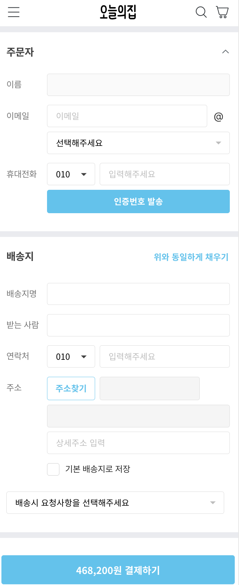

_2023-04-04에 작성된 [원문](https://ps-hjhj97.tistory.com/226)을 수정한 버전입니다_

## 반복되는 `input` 태그

사용자에게 입력을 받기 위해서는`input`태그가 필요한데, 입력 받는 데이터의 종류와 특성에 따라 제공되는 기능이 달라질 수 있다. 예를 들어 '오늘의 집'의 주문 페이지를 살펴보자.


<!---->

- 이름이나 주소같은 단순한 텍스트 : `<input type="text">`
- 문자가 아닌 오직 숫자만 입력받을 경우(상품 수량) `<input type="number">`
- 전화번호 형식 `<input type="tel">`
- 이메일 형식 `<input type="email">`

  이처럼 같은 `input`태그라도 각각의 특성과 수행해야 될 기능이 다르다.  
  이름이나 주소의 경우에는 빈 문자열이어서는 안된다거나 최소/최대 글자수 제한이 있을 수 있고, 전화번호나 이메일은 유효성 검증을 거쳐야 할 수도 있다.

  `type`속성으로으로도 어느정도 해결할 수는 있지만, 이러한 기능을 가진 `input` 태그들이 프로젝트에서 반복적으로 사용된다면 컴포넌트로 분리시켜 공통화하고 싶다는 생각이 든다. 그러면 각 `<Input>` 컴포넌트별로 특정 기능에만 집중할 수 있다. 그렇다면 커스텀 컴포넌트화 시키려면 어떻게 해야하는지 살펴볼 건데, 그 전에 `v-model`의 작동원리에 대해서 알아보자.

## `v-model`의 작동원리

vue의 `v-model`은 양방향 데이터바인딩(two-way binding) 기능을 제공하는 `directive`이다.  
양방향 바인딩이란, 화면상에 보이는 `<input>`에 데이터를 입력(수정)할 때마다 `Javascript`에서도 실시간으로 변화를 감지하여 값이 업데이트 되는 기능이다.

SPA 라이브러리를 vue로 처음 입문한 사람에게는 `v-model`이 왜 편리한 기능인지 이해하기 어려울 수 있지만, react를 접한 뒤에 `v-model`을 만난다면 그 편리함에 감탄할 것이다. 왜냐하면 react에서 양방향 바인딩을 구현하기 위해서는 `<input>`태그에 다음와 같이 작성해야만 했다.

#### react

```jsx
const [text, setText] = useState("")
const onInputChange = e => {
  setText(e.target.value)
}
...
return <input onChange={onInputChange} value={text} />
```

하지만 이를 vue에서 `v-model`로 구현한다면 간단하게 구현할 수 있다.

#### vue

```jsx
// <template>
<input v-model="text">
// <script setup>
const text = ref('');
```

두 코드 사이에서 주목해야 할 점은 react의 경우에 `<input>` 태그에 `onChange`와 `value` 2개가 필요한 반면에, vue에서는 `v-model` 단 하나만 필요하다는 점이다. 단순히 생각해보더라도 `v-model`이 `onChange`와 `value` 2개의 역할을 동시에 수행하고 있으리라 예상할 수 있다.  
사실은 vue도 `v-model`을 사용하지 않고 양방향 바인딩을 구현해보자면 아래와 같이 구현해야 했다.

#### vue

```jsx
// <template>
<input @change="onChangeInput" :value="text">
// <script setup>
const text = ref('');
const onChangeInput = (e) => {
  text.value = e.target.value
}
```

하지만 매번 두 개의 속성을 적어주는 건 성가신 일이기 때문에 이를 하나로 합쳐서 `v-model`이 탄생하게 된 것이다.
vue에서는 이처럼 tag 레벨에서 자주 쓰이는 기능들은 하나의 공통 함수로 묶게 되었는데 이게 바로 vue의 `directive`이다.

> 필자 개인의견 : `v-model`이 react와 vue가 추구하는 방향성의 다름을 가장 잘 보여주는 대목이다. react는 코드 뒷편에서 무슨 일이 일어나는지 최대한 개발자에게 숨기지 않고 드러내려는 반면, vue는 '이 기능은 라이브러리에서 책임질테니, 무슨 일이 일어나는 지는 신경쓰지 마'라고 말하는 인상이 들었다.

## 커스텀 컴포넌트로 만들기

`<input>`을 컴포넌트화 시켜서 부모-자식간의 관계가 형성되면 부모 컴포넌트에서 자식 컴포넌트로`v-model`를 별도로 연결시켜주어야만 양방향 데이터 바인딩 기능을 유지할 수 있다.

방법은 어렵지 않다. 부모 컴포넌트 입장에서는 컴포넌트화하기 이전 코드와 동일하게 `v-model="data"`를 걸어주기만 하면 된다. 이렇게만 하면 자식 컴포넌트의 `props`에서 자동으로 `modelValue`라는 (미리 정해진)이름으로 받을 수 있게 된다.

다만 자식 컴포넌트에서는 별도로 처리해줘야 한다. `v-model="modelValue"`로 받을 수 있을 것 같지만 아쉽게도 불가능하다. 왜냐하면 `v-model`은 `@input="(e) => modelValue = e.target.value"`가 생략되어있는데, vue에서 자식 컴포넌트가 받은 `props`값(여기서는 `modelValue`)의 직접 변형이 불가능하기 때문이다.

이를 해결하기 위해서는 자식 컴포넌트에서는 input 이벤트가 발생하면 부모 컴포넌트에게 이를 알려야 한다.  
자식컴포넌트가 부모컴포넌트에게 이벤트를 발생시키고 싶을 때 호출하는`emit`함수를 통해  
 _"`modelValue`의 값이 `e.target.value`로 변했다"_  
 는 정보만 전달하고, 실질적인 변경된 값을 반영하는 과정은 부모 컴포넌트에서 진행되야 한다. 다행히도 그 과정은 이미 `update:modelValue`라는 이벤트로 미리 등록되어 있기 때문에 우리가 직접 구현할 필요는 없다.

#### MainPage.vue (parent)

```jsx
<template>
  <div>
    <MyInput v-model="num" />
    <p>text : {{ num }}</p>
  </div>
</template>

<script setup>
import { ref } from "vue";
import MyInput from "@/components/MyInput.vue";

const num = ref("Hello");
</script>


```

#### MyInput.vue (child)

```jsx
<template>
  <!-- 불가능 -->
  <!-- <input v-model="modelValue" />  -->

  <input :value="modelValue" @input="onInput" />
</template>

<script setup>
const props = defineProps({
  modelValue: String,
});

const emit = defineEmits(["update:modelValue"]);

const onInput = (e) => {
  const newValue = e.target.value;
  emit("update:modelValue", newValue);
};
</script>


```

## 구현

<iframe src="https://codesandbox.io/embed/vue-custom-input-3tnt3q?fontsize=14&hidenavigation=1&theme=dark"
     style="width:100%; height:500px; border:0; border-radius: 4px; overflow:hidden;"
     title="vue-custom-input"
     allow="accelerometer; ambient-light-sensor; camera; encrypted-media; geolocation; gyroscope; hid; microphone; midi; payment; usb; vr; xr-spatial-tracking"
     sandbox="allow-forms allow-modals allow-popups allow-presentation allow-same-origin allow-scripts"
   ></iframe>

_다음 포스팅에서 'input 종류별로 기능 적용하기'를 소개하겠습니다_
