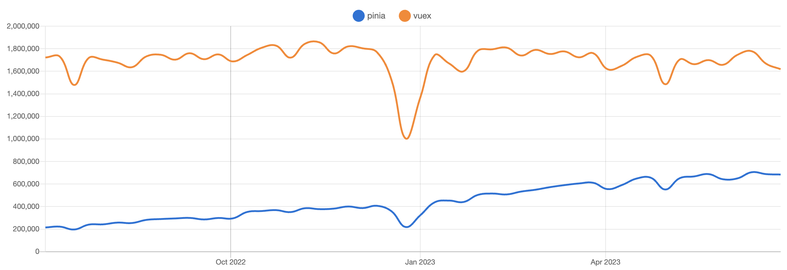

## pinia란?

기존 vue의 전역 상태관리 라이브러리는 거의 `vuex`가 독점하다시피 한 시장이었다. 옆 동네 react만 하더라도 `redux`,`recoil`,`MobX`,`zustand`와 같이 여러 라이브러리 중에서 선택할 수 있었지만, vue에서는 선택권 없이 사실상 99% `vuex`를 써야했다. 오히려 이 점이 학습에 대한 부담(여러 라이브러리 두루 알고 있어야 함)을 줄여주기도 했지만, vuex의 아쉬운 점을 대체할 수단이 없다는 단점을 껴안고 있었다.

그러다가 2019년 11월에 `vuex`의 experiment to redesign(리디자인 실험)으로서 `pinia`가 처음 출시되었고, 현재는 `vuex`를 대신하여 vue의 공식 상태관리 라이브러리로 자리잡았다. 이름은 달라졌다고는 해도 `vuex` 개발팀이 `pinia`를 개발했기 때문에 기존 `vuex`의 기능과 문법은 거의 바뀌지 않았고 새로 학습해야할 내용도 부담 없는 수준이다.(공식문서에서는 `pinia`를 `vuex 5`의 다른 이름이라고 소개한다)

[npmtrends](https://npmtrends.com/pinia-vs-vuex)를 보더라도 `vuex`와의 격차가 점점 줄어들고 있음을 확인할 수 있다.


## vuex와 비교해 달라진 점

#### 1. 다중 store

`vuex`에서 여러 종류의 store를 사용할 경우 일반적으로 modules 디렉토리 밑에 몰아넣고 `index.js`에서 하나로 합쳐주는 방식을 사용하였다.

```
// vuex
src
└── store
    ├── index.js
    └── modules
        ├── counter.js
        ├── user.js
        ├── order.js
        └── ...
```

하지만 `pinia`에서는 다중store를 지원하기 때문에 modules를 사용할 필요가 없어졌다. 따라서 stores 디렉토리 밑에 모든 store를 둘 수 있게 되었다. (개인 선호에 따라 `stores/index.js`를 두어서 기본 설정을 초기화하는 코드를 작성하기도 한다.)

```
// pinia
src
└── stores
    ├── counter.js
    ├── user.js
    ├── order.js
    └── ...
```

#### 2. mutation 없이 state의 직접 변경 가능

기존 `vuex`에서는 state의 값을 변경하려면 반드시 `mutation`을 통해야 했다.  
가령 `count`라는 state와 이 값을 증가시키는 `increment`라는 함수가 있다고 하자.

```javascript
// vuex
const store = createStore({
  state: {
    count: 1,
  },
  mutations: {
    increment(state) {
      state.count++
    },
  },
})
```

`count`값을 증가시키기 위해서는 반드시 `mutation`에 등록된 함수를 통해서만 접근해야 한다.
`store.state.count++`처럼 직접적으로 state를 변경시키는 건 허용되지 않았다.

```jsx
// vuex
<template>
  <p>{{ $store.state.count }}</p>
</template>
<script>
  ...
  setup(){
    // store.state.count++; // 직접 변형 불가
    store.commit('increment'); // 반드시 mutation을 통해서만 변형
  }
</script>
```

<br />
<br />

하지만 `pinia`에서는 `mutation`이 사라지고 값의 직접 변형이 가능해졌다. 따라서 매번 state값을 변경하기 위한 `mutation`함수를 만들 필요가 없어졌기 때문에 상당히 편리해졌다.

```javascript
// pinia
export const useCounterStore = defineStore("counter", {
  state: () => {
    return {
      count: 1,
    }
  },
})
```

그러면 `counterStore`로 받아오기만 하면 된다.

```jsx
// pinia
<template>
  <p>{{ counterStore.count }}</p>
</template>
<script>
  ...
  setup(){
    const counterStore = useCounterStore();
    counterStore.count++; // 직접 변경 가능
    return{
      counterStore,
    }
  }
</script>
```

변경해야 하는 값이 복잡하거나, 따로 함수로 분리하고 싶다면 `actions`에서 선언하거나 혹은 아래에서 설명할 `$patch` 라는 내장 메소드를 사용하면 된다.

#### 3. Typescript 호환성 증가

`vuex`에서는 도입하기 까다로웠던 `typescript`가 `pinia`에서는 쉽게 사용할 수 있게 되었다.

```typescript
// pinia
interface VueLib {
  state: "vuex" | "pinia"
}

export const useCounterStore = defineStore("counter", {
  state: () => {
    return {
      count: 0 as number,
      library: {
        state: "pinia",
      } as VueLib,
    }
  },
})
```

## 프로젝트 도입 후기

#### 1. mutation 이 없어서 정말 편리하다

위에서 언급했다시피 state값의 직접 변형이 가능하기 때문에 별도의 `mutation`을 선언할 필요가 없다는 점이 `vuex`로 개발하면서 느꼈던 답답함을 한방에 뚫어주는듯한 기분이다. 덕분에 `store` 코드의 절반 가량을 차지하던 부분이 사라졌으니 코드가 상당히 가벼워지고 가독성도 나아졌다.

#### 2. 생각보다 유용한 내장 메소드

`pinia`에서는 Option API 기준으로 3개의 내장 메소드를 갖고 있다.

- `$reset()` : 현재 store의 `state` 값들을 모두 초기화시킨다. 예를 들어 회원 로그인시 회원 데이터를 store에 갖고 있다가 로그아웃을 하면 값을 초기화해주어야 할 때 사용한다. 기존 `vuex`에서는 개발자가 직접 reset함수를 만들어야 했는데 `pinia` 에서는 그럴 필요가 없어졌다.

- `$patch(state)` : state값을 변경시켜주는 함수이다. `pinia`는 값의 직접 변경이 가능한데 왜 굳이 필요한가 싶을 수 있는데, 여러 변수들의 값을 한번(함수 하나)에 변경하려고 할 때나 값의 변경 로직이 복잡해지면 오히려 `mutation`이 그리워 질 수도 있다. `$patch()`함수가 그 역할을 대신한다.

```javascript
counterStore.$patch({ count: 1 })
OR
counterStore.$patch(state => {
  state.count = state.count + 1
})
```

- `$subscribe(mutation,state)` : 현재 store의 `state`값을 `watch`하는 기능이라고 생각하면 된다. 프로젝트에서는 이 기능을 써보지 않아서 정확히 어떤 상황에 필요할 지는 잘 모르겠다.

#### 3. modules가 없어져서 코드 양은 쪼금 늘어날 수 있다

개인적으로 한가지 아쉬운 점은 모든 store를 하나로 묶어주는 modules 기능의 부재로 인하여 `vuex`의 `template`레벨에서 `state`값을 가져올 때처럼 `$store.state.[store이름]` 식으로 접근할 수 없다는 점이다.

```jsx
// vuex
<tempalate>
  <div>{{$store.state.counter.count}}</div>
</template>

```

하지만 `pinia`에서는 반드시 `script`레벨에서 `use*Store()` 훅을 이용하여 `*store`를 한번 빼와야만 `template`레벨에서도 값을 전달할 수 있다. 그래서 코드의 양이 `vuex`대비 늘어날 수도 있다. 그렇다고 이거 하나가 단점이라 지적하기엔 사소한 문제이고 1,2번에서 얻을 수 있는 이점이 훨씬 더 크다고 생각한다.

```jsx
// pinia
<tempalate>
  <div>{{counterStore.count}}</div>
</template>
<script>
  ...
  setup(){
    const counterStore = useCounterStore();
    return{
      counterStore,
    }
  }
  </script>

```

## 총평

`pinia`는 `vuex`와 비교하여 typescript 지원, mutation 삭제, 다중 store지원 같은 기능으로 인하여 DX(개발 경험)을 상당히 개선시켜 주었다. 커뮤니티와 자료의 양이 아직 `vuex`만큼은 아니지만 조금씩 쌓여나가고 있다는 점에서 `pinia` 도입을 주저하는 개발자가 있다면 주저하지 말고 한번 써보라고 추천하고 싶다.
