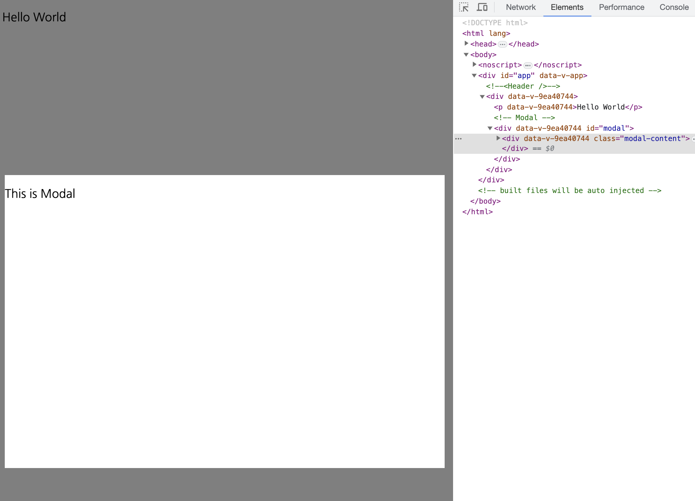
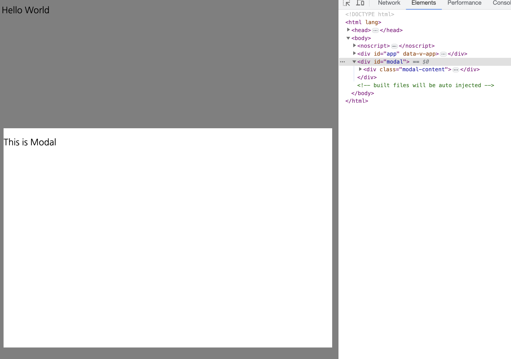

_2023-03-09에 작성된 [원문](https://ps-hjhj97.tistory.com/222)을 수정한 버전입니다_

웹사이트를 이용하다 보면 모달창을 마주하게 된다. 일반적인 모달은 화면이 어두워지면서 기존의 화면은 fade out되면서, 화면 한가운데에서 focus되는 alert창과 같은 형태이다. 이를 `vue`로 어떻게 구현하는지 살펴보자.

## 모달 구현

`vue`로 모달을 구현하는 방법에는 여러가지가 있을 수 있다. 가장 간단한 형태는 하나의 파일 안에 모달을 다 집어넣는 방식일 것이다.

```jsx
// MyModal.vue
<template>
  <div>
    <p>Hello World</p>

    <!-- Modal -->
    <div id="modal">
      <div class="modal">
        <div class="modal-content">
          <p>This is Modal</p>
        </div>
      </div>
    </div>
  </div>
</template>

<style>
  @import url('.../modal.css')
</style>
```

```css
/* modal.css */
.modal {
  position: fixed;
  z-index: 10;
  inset: 0;
  background-color: rgba(0, 0, 0, 0.5);
}
.modal .modal-content {
  position: absolute;
  width: 600px;
  height: 400px;
  top: 50%;
  left: 50%;
  transform: translate(-50%, -50%);
  background-color: #fff;
}
```

<br />

이 방식의 경우 아래 사진과 같이 `<div id="modal">`태그는 기존 화면이 위치하고 있는 DOM노드 하위에 종속될 수 밖에 없다.



여기서 한 가지 아쉬운 점이 생긴다. modal 창은 기존의 화면과 구분되는 속성인데 DOM 노드상에서도 이를 구분할 수 없을까? 즉 `<div id="modal">`이 `<div id="app">`과 같은 레벨로 끌어올릴 수 없을까? 하는 생각을 품게된다.

#### `teleport`

이를 해결하기 위해 `vue`에서 제공하는 `teleport` 기능을 적용해보자. `teleport`란 [공식문서](https://ko.vuejs.org/guide/built-ins/teleport.html#basic-usage)상에서는

> 컴포넌트 템플릿의 일부를 해당 컴포넌트의 DOM 계층 외부의 DOM 노드로 "이동"할 수 있게 해주는 빌트인 컴포넌트입니다.

라고 설명하고 있다. 간단하게 요약하자면 기존에 보여지고 있던 화면과 논리적/기능적으로 구분된 또다른 화면을 표시해야할 때, 기존의 DOM 노드가 아닌 별도의 DOM노드로 마치 teleport(순간이동)할 수 있는 기능이다.

이를 사용하기 위해서는 일단 DOM이 그려지는 `index.html`안에 `<div id="modal">`이라는 새로운 태그를 추가한다. (id 대신에 class를 사용하더라도 작동은 정상적으로 하지만, 중복 문제를 피하기 위해 관습적으로 id를 사용하는 듯 하다.)

```html
<!-- index.html -->
<html>
  <head>
    ...
  </head>
  <body>
    <noscript> ... </noscript>
    <div id="app"></div>
    <div id="modal"></div>
  </body>
</html>
```

그리고 기존에 있던 `MyModal.vue`에서는 `<div id="modal">`한 겹을 벗겨내고 대신에 `<teleport to="#modal">`을 넣어주면 된다.

```jsx
<template>
  <div>
    <p>Hello World</p>

    <!-- Modal -->
    <teleport to="#modal">
      <div class="modal">
        <div class="modal-content">
          <p>This is Modal</p>
        </div>
      </div>
    </teleport>
  </div>
</template>
```

<br />

그러면 `<div id="modal">`이 `<div id="id">`와 DOM상에서 같은 레벨에 생성된 것을 확인할 수 있다.



## 모달 열고 닫기

그렇다면 이제 이 모달을 동적으로 열고 닫을 수 있어야 한다. 방법은 예상하다시피 `v-if`
나 `v-show`를 사용하면 된다. 하지만 사용 방식에는 조금 차이가 있다.

`<teleport>`에는 오직 `v-if`만 사용할 수 있고, `v-show`는 작동하지 않는다. `v-show`를 사용하기 위해서는 `<teleport>`하위의 최상단 root노드에 걸어야만 작동한다.

`v-if`는 값이 `false`일 경우 렌더링 시점에서 아예 제외되므로 `<teleport>`에 걸면 하위의 모든 노드들이 렌더링되지 않지만, `v-show`의 경우에는 일단 렌더링하고나서 값에 따라 `display:none`으로 처리하는데 `<teleport>`는 `html` 태그가 아닌 `vue`에서 제공하는 기능에 불과하므로 `display:none`이 걸리지 않는다.

```jsx
<template>
  <div>
    <p>Hello World</p>
    <button @click="isModalOpen = true">open</button>

    <!-- Modal -->
    <teleport to="#modal" v-if="isModalOpen">
      <div class="modal">
        <div class="modal-content">
          <p>This is Modal</p>
          <button @click="isModalOpen = false">close</button>
        </div>
      </div>
    </teleport>
  </div>
</template>

<script setup>
  import { ref } from 'vue';
  const isModalOpen = ref(false);
</script>
```
